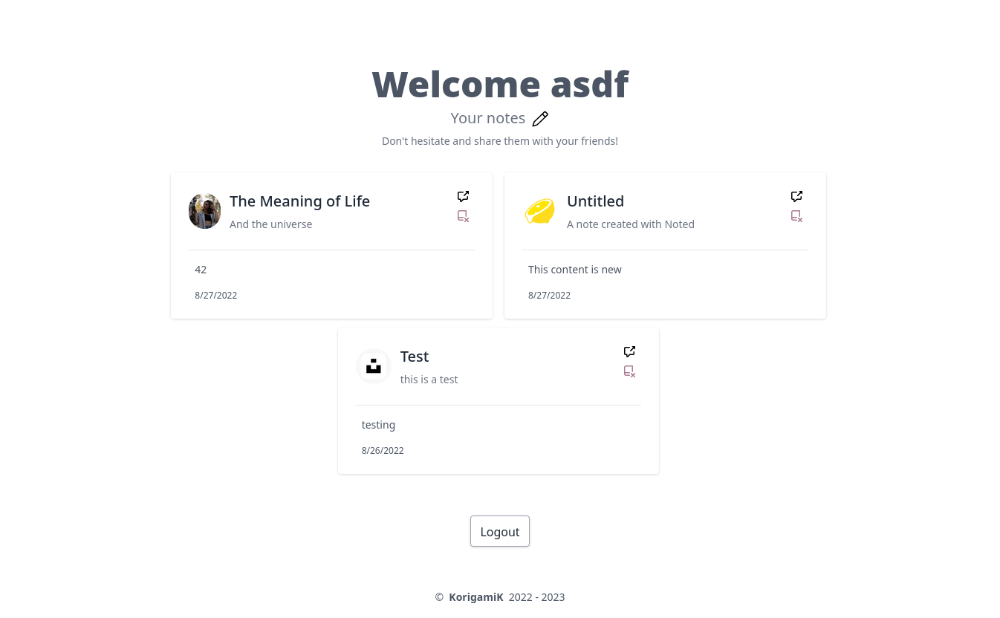
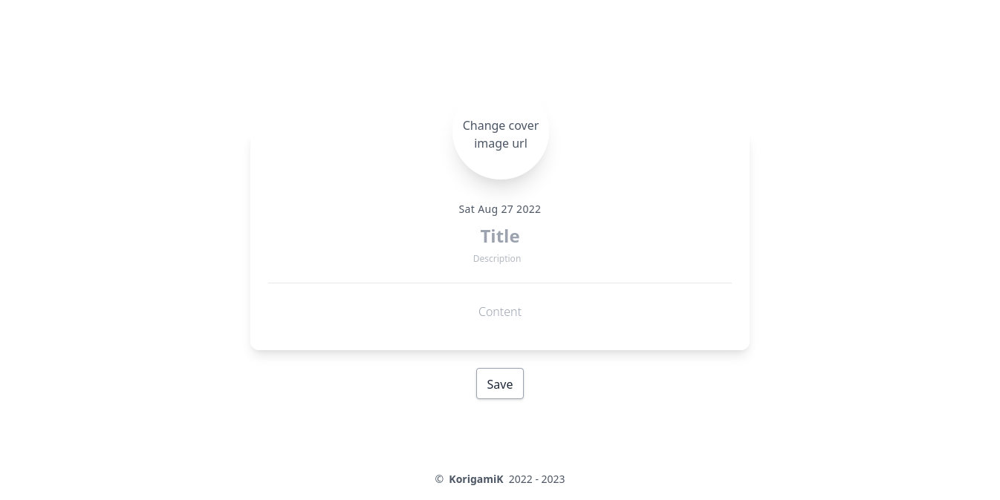
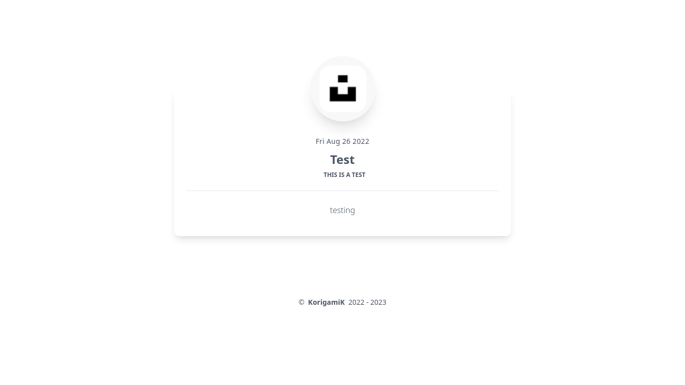

# Noted


A minimalist note-taking as well as sharing app.

## Table of Contents

- [Noted](#noted)
  - [Table of Contents](#table-of-contents)
  - [Showcase](#showcase)
    - [Home](#home)
    - [Sign Up](#sign-up)
    - [Log In](#log-in)
    - [Success](#success)
    - [Dashboard](#dashboard)
    - [Create](#create)
    - [Owned Notes](#owned-notes)
    - [Public Notes](#public-notes)
    - [Error](#error)
  - [Highlights](#highlights)
  - [Development](#development)
  - [Known Issues](#known-issues)
  - [License](#license)

## Showcase

<details>
  <summary>
  Expand
  </summary>

### Home

  

### Sign Up

  

### Log In

  

### Success
  
  

### Dashboard
  
  

### Create

  

### Owned Notes

  

### Public Notes
  
  
  
### Error

  
</details>

## Highlights

- Everything in TypeScript
- MongoDB with completely typed schema
- Persistent sessions using JSON Web Tokens (JWT)
- Free deployment using Deno deploy
- Public notes can be shared with anyone
- Using twind instead of tailwind

## Development

- Create a .env file in the root directory and set the following variables:
  - `__MONGO_DB_URI__` = `"mongodb+srv://<username>:<password>@<host-url>/?authMechanism=SCRAM-SHA-1"`

  - ` __DEVELOPMENT__ `= `True` If you want to persist logins across server restarts

- Start the project:

```bash
deno task start
```

This will watch the project directory and restart as necessary.

## Known Issues

- Web workers are not supported in Deno deploy. This means that async Bcrypt is not supported. This is a temporary issue and will be fixed in the future.
  - [Relevant Issue](https://github.com/JamesBroadberry/deno-bcrypt/issues/26)

## License

[](https://opensource.org/licenses/MIT)

[](https://fresh.deno.dev)
